class: center, middle

## Artificial Intelligence

# Decision Making for Games

<br>

Gerard Escudero, 2020

<br>


.footnote[[source](https://external-content.duckduckgo.com/iu/?u=http%3A%2F%2Frevolucioninterior.files.wordpress.com%2F2012%2F01%2Fdecision-making.jpg&f=1&nofb=1)]

---
class: left, middle, inverse

# Outline

* .cyan[Introduction]

* Finite State Machines

* Decision Trees

* Behaviour Trees

* Planning Systems

* Rule-Based Systems

* References

---

# GameAI: the Model

.center[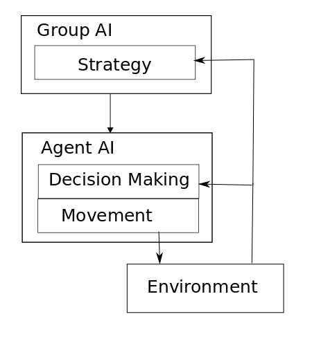]

.footnote[.red[(Millington, 2019)]]

---

# Decision Making

.cols5050[
.col1[
- .blue[Input]: World Knowledge

- .blue[Output]: Action

- .blue[Important rule]: <br>
Decision Making should **NOT** execute every frame!

- Main algorithms:
  - Finite State Machines
  - Behaviour Trees
  - Goal Oriented Action Planning


.small[[GOAP](https://gamedevelopment.tutsplus.com/tutorials/goal-oriented-action-planning-for-a-smarter-ai--cms-20793)]
]
.col2[
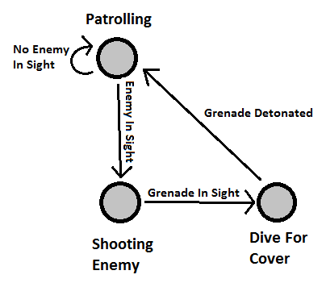 <br>
.small[[FSM](https://martindevans.me/assets/FiniteStateMachine.png)]

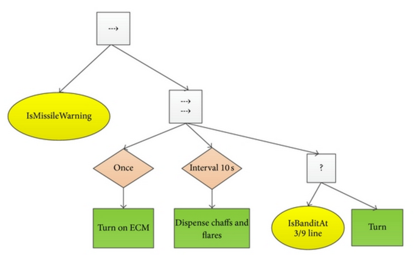 <br>
.small[[BT](https://www.researchgate.net/figure/Example-of-missile-evasion-tactic-behavior-tree_fig1_288917868)]
]]

---
class: left, middle, inverse

# Outline

* .brown[Introduction]

* .cyan[Finite State Machines]

  - .cyan[Code (delegates)]

  - Visual Scripting

  - Hierarchical FSM

* Decision Trees

* Behaviour Trees

* Planning Systems

* Rule-Based Systems

* References

---

# C# coroutines

**Example**:

```C#
using UnityEngine;
using System.Collections;
public class WaitForSecondsExample : MonoBehaviour {
    void Start() {
        StartCoroutine(“Example”);
    }
    
    IEnumerator Example() {
        Debug.Log(Time.time);
        yield return new WaitForSeconds(5);
        Debug.Log(Time.time);
    }
}
```

- `StartCoroutine`: type of asynchronous "functions"

- `IEnumerator`: returning type

- `yield`: stops execution until something happens

---

# C# delegates

assigning functions to variables

**Example**:

```C#
public class DelegateScript : MonoBehaviour {
    delegate void MyDelegate(int num);
    MyDelegate myDelegate;
    
    void Start () {
        myDelegate = PrintNum;
        myDelegate(50);
        myDelegate = DoubleNum;
        myDelegate(50);
    }
    
    void PrintNum(int num) {
        Debug.Log(num);
    }
    
    void DoubleNum(int num) {
        Debug.Log(num * 2);
    }
}
```
---

# FSMs in Unity

[Scene](resources/dm1-handout.unitypackage):

.center[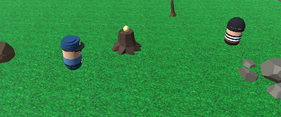]

.blue[Task]: FSM for the *robber*:

.center[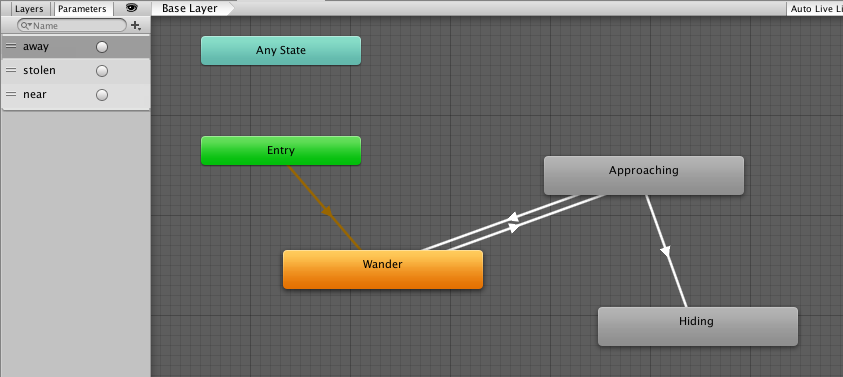]

---

# FSM with coroutines & delegates

.blue[Code template]:

```C#
public class FSM : MonoBehaviour
{
    ...
    private WaitForSeconds wait = new WaitForSeconds(0.05f);   // 1 / 20
    delegate IEnumerator State();
    private State state;

    IEnumerator Start()
    {
        ...
        state = Wander;
        while (enabled)
            yield return StartCoroutine(state());
    }

    IEnumerator Wander()
    {
        Debug.Log("Wander state");
        ...
    }
}
```

---

# TODO

1. Coroutine that executes 20 times per second and goes forever

2. Explicit every state change with `Debub.Log`

3. First behaviour is slowly .blue[wander]

4. When the *cop* walks away from the treasure he has to .blue[approach] quickly to steal it

5. If the *cop* comes back he returns to .blue[wander] slowly and so on

6. If the robbery is successful (the treasure must disappear), he begins to permanently .blue[hide] in the obstacle closest to the *cop*

.blue[solution]: [view](codes/fsm.html).red[*] / [download](codes/fsm.cs)

### Homework

- Watch the videos (5mn): [Killzone 2 Review about AI](https://www.youtube.com/watch?v=iBN46XUpdaQ) & [F.E.A.R. 2 - A.I.](https://www.youtube.com/watch?v=iBN46XUpdaQ)

.footnote[.red[*] made with .red[[hightlighting](https://tohtml.com/csharp/)]]

---
class: left, middle, inverse

# Outline

* .brown[Introduction]

* .cyan[Finite State Machines]

  - .brown[Code (delegates)]

  - .cyan[Visual Scripting]

  - Hierarchical FSM

* Decision Trees

* Behaviour Trees

* Planning Systems

* Rule-Based Systems

* References

---

# Visual Scripting

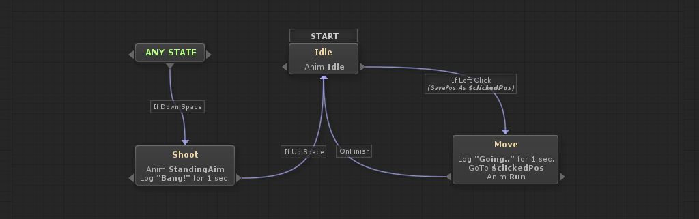

- Visual editors helps handling complex behaviours

- Separates coders from game designers

- Many options:
  - CryEngine’s flowgraph
  - Unreal Kismet / Blueprint
  - Unity PlayMaker
  - ...

---

# [NodeCanvas](https://nodecanvas.paradoxnotion.com/)

- Includes FSM, hierarchical FSM and Behavior Trees

- Decent [documentation](https://nodecanvas.paradoxnotion.com/documentation/)

- It allows the creation of [new actions](http://nodecanvas.paradoxnotion.com/documentation/?section=creating-custom-tasks)


---

# TODO

.blue[Robber] behaviour: [handout](resources/dm1-handout.unitypackage)

### Starting

1. Add component _FSM Owner_
2. Create New - FSM
3. In the NodeCanvas Editor - Right Button - Action State
4. Assign Action Task

### Action Tasks

- Movement - Pathfinding - Seek
- Movement - Pathfinding - Wander
- Script Control - Multiplatform - Execute Function
- GameObject - Set Visibility

### Condition Tasks

- Blackboard - Check Vector Distance
- GameObject - Target Within Distance

---

# Solution

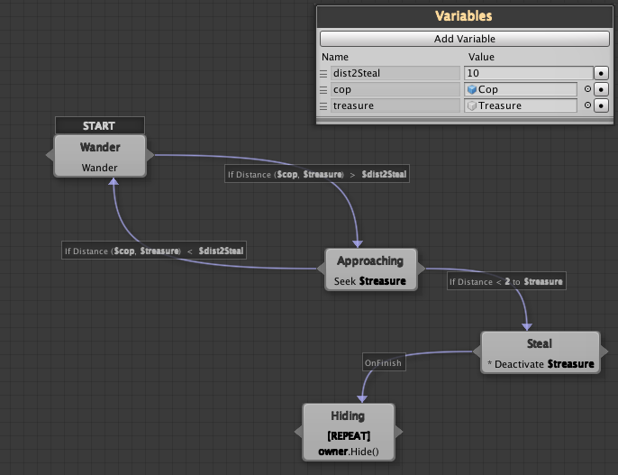

---

# FSM with Unity's Animator


- Wander State: [view](codes/Wandering.html).red[*] / [download](codes/Wandering.cs)
- Approaching State: [view](codes/Approaching.html).red[*] / [download](codes/Approaching.cs)
- Hiding State: [view](codes/Hiding.html).red[*] / [download](codes/Hiding.cs)
- BlackBoard: [view](codes/BlackBoard.html).red[*] / [download](codes/BlackBoard.cs)

.footnote[.red[*] made with .red[[hightlighting](https://tohtml.com/csharp/)]]

---
class: left, middle, inverse

# Outline

* .brown[Introduction]

* .cyan[Finite State Machines]

  - .brown[Code (delegates)]

  - .brown[Visual Scripting]

  - .cyan[Hierarchical FSM]

* Decision Trees

* Behaviour Trees

* Planning Systems

* Rule-Based Systems

* References

---

# Hierarchical FSM

.blue[Complex Behaviours]:

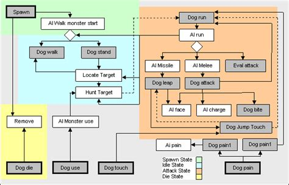

.footnote[.red[[source](https://external-content.duckduckgo.com/iu/?u=https%3A%2F%2Ftse1.mm.bing.net%2Fth%3Fid%3DOIP.NCv3KRpusfvK90lOdyXAcAHaEv%26pid%3DApi&f=1)]]
---

# HFSM in NodeCanvas

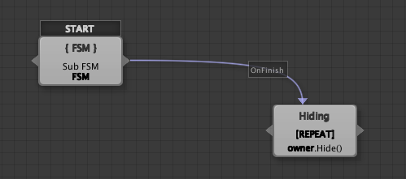

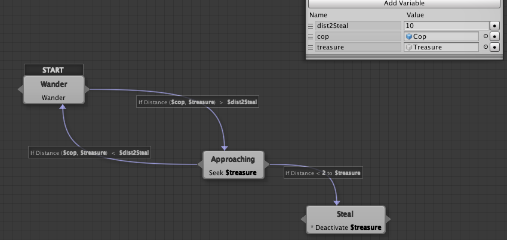

---
class: left, middle, inverse

# Outline

* .brown[Introduction]

* .brown[Finite State Machines]

* .cyan[Decision Trees]

* Behaviour Trees

* Planning Systems

* Rule-Based Systems

* References

---

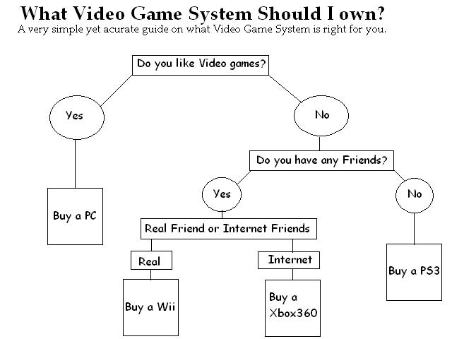

[source](https://nyc3.digitaloceanspaces.com/dula/wp-content/uploads/2009/05/08151726/consolechartyr2yb63272359-1.jpg)

---

# FSM vs DTs

- FSM: .blue[States] (with Actions) & .blue[Transitions] (with conditions)

- DTs: .blue[Conditions] (tree nodes) & .blue[Actions] (leafs). 

- It has no notion of state; we have to go through the whole tree every time we run it.

- How could we use decision trees in games?
  - NPCs Dialogs
  - Bosses that switch state every % HP
  - … ?

- Decision trees can be generated automatically. <br>
We will see this in the topic of machine learning.

---

# NodeCanvas Example

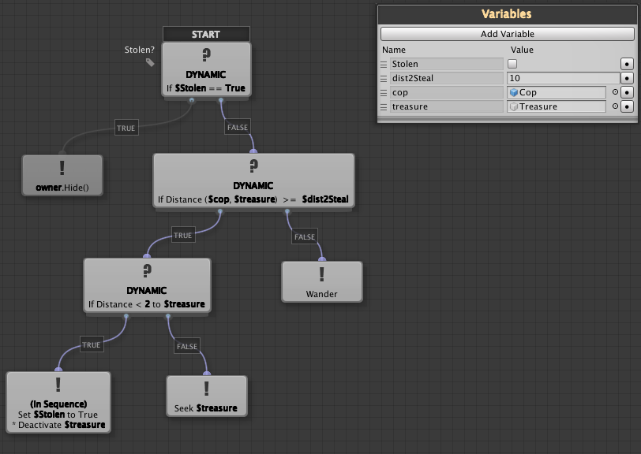

---
class: left, middle, inverse

# Outline

* .brown[Introduction]

* .brown[Finite State Machines]

* .brown[Decision Trees]

* .cyan[Behaviour Trees]

  - .cyan[Design]

  - NodeCanvas

  - Behaviour Bricks

* Planning Systems

* Rule-Based Systems

* References

---

# Behaviour Trees

.cols5050[
.col1[
- Sort of visual programming for AI behaviour ([Isla, 2005](https://www.gamasutra.com/view/feature/130663/gdc_2005_proceeding_handling_.php))
  - Reusability & modularity
  - Major engines: unreal, cryengine, unity

- Behavior Tree combine both: 
  - *Decision trees*: execute all at once
  - *State machines*: current state implicit
  - **the execution stays in one of the nodes**

- .blue[Designing Trees is a hard task!] <br>
Reference: [_Behavior trees for AI: How they work_](https://www.gamasutra.com/blogs/ChrisSimpson/20140717/221339/Behavior_trees_for_AI_How_they_work.php)]
.col2[
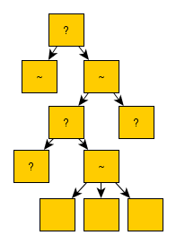
]]

---

# Node Types I

### Actions

- All should return **Running**, **Success** or **Failure**
- They can take a while!
- Most of the time they will be leaf nodes

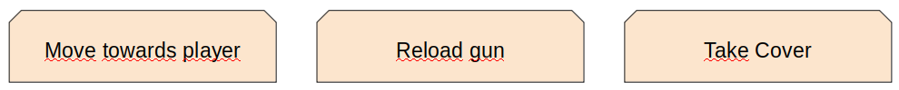

### Conditions

- All should return **True** or **False**
- Conditions normally refer to the **blackboard** for questioning the world state

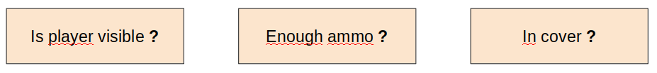

---

# Node Types II

### Composites

- All should return **True** or **False**
- They iterate all childs from left to right in a specific fashion:
  1. .blue[Sequence] (AND): A node that executes all its children until one fails
  2. .blue[Selector] (OR): A node that executes all its children until one succeeds
  3. .blue[Parallel] (Concurrent AND): Execute all its children at the same time until one fails
  4. .blue[Random Sequence or Selector] (with %?): Same as sequence or selector but randomly
  5. .blue[Priority Sequence or Selector] (with %#): Same as sequence or selector but follow a mutable priority

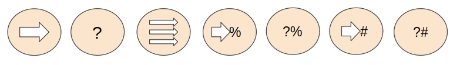

---

# Node Types III

### Decorators

- All should return **Running**, **Success** or **Failure**
- Add enormous flexibility and power to the tree execution flow
- They modify one specific child in some fashion:
  1. .blue[Inverter] (NOT): invert the result of the child node
  2. .blue[Repeater] (until fail, N or infinite): basically repeat the child node until fail or N times
  3. .blue[Wait until] (seconds, condition, etc.): basically a generic delay


---

# Examples I

.center[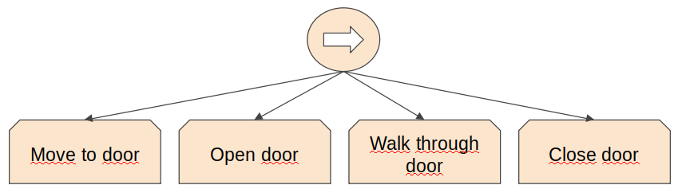]

.footnote[[_Behavior trees for AI: How they work_](https://www.gamasutra.com/blogs/ChrisSimpson/20140717/221339/Behavior_trees_for_AI_How_they_work.php)]

--

.center[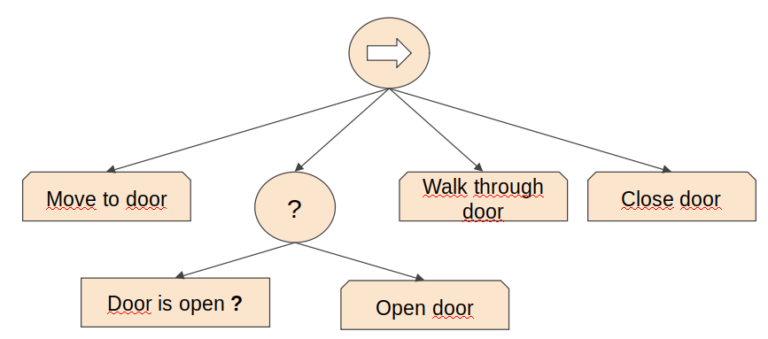]


---

# Examples II

.center[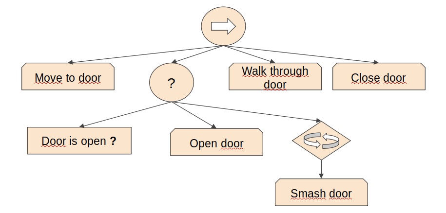]

.footnote[[_Behavior trees for AI: How they work_](https://www.gamasutra.com/blogs/ChrisSimpson/20140717/221339/Behavior_trees_for_AI_How_they_work.php)]

## What about the Robber?

- Exercise / homework: [Template for design BTs](figures/BTNodes.png), [a solution](figures/RobberBT.jpg)

---
class: left, middle, inverse

# Outline

* .brown[Introduction]

* .brown[Finite State Machines]

* .brown[Decision Trees]

* .cyan[Behaviour Trees]

  - .brown[Design]

  - .cyan[NodeCanvas]

  - Behaviour Bricks

* Planning Systems

* Rule-Based Systems

* References

---

# TODO

- Add Component - Behaviour Tree Owner ([handout](resources/dm1-handout.unitypackage))

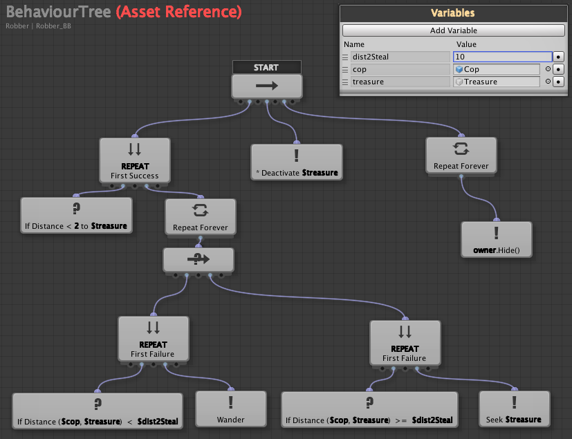

---

# Nested Behaviour Trees I

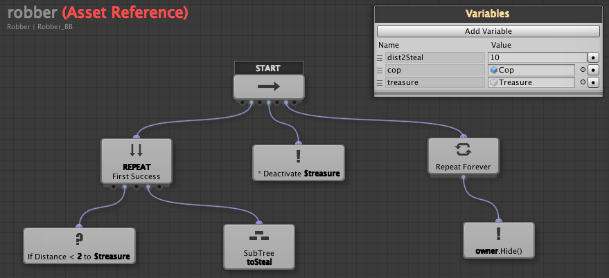

---

# Nested Behaviour Trees II

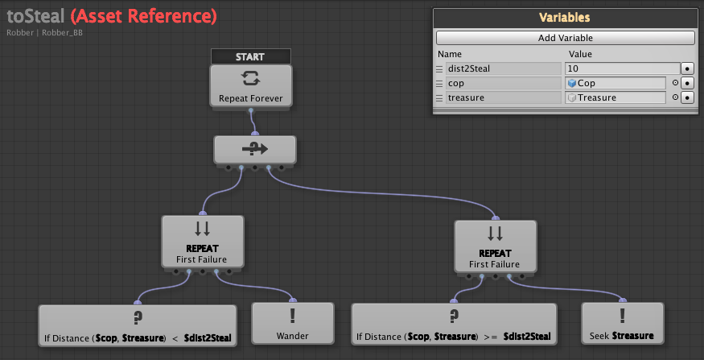

---

# Nested FSM in BT I

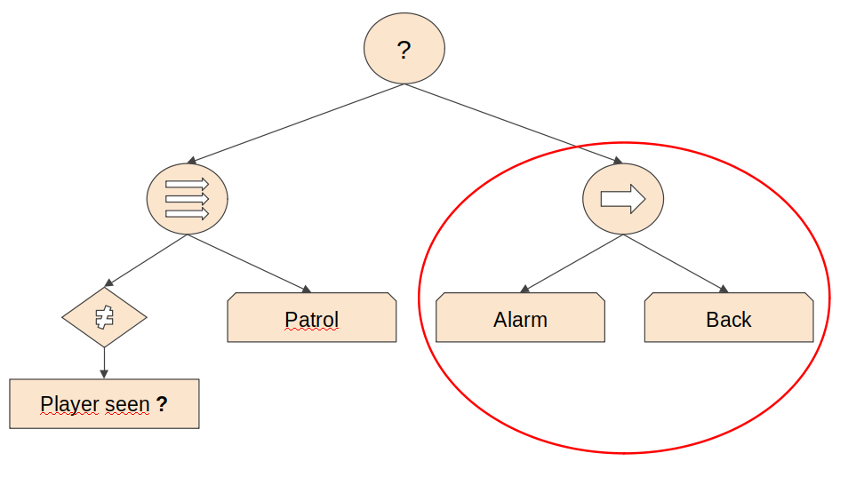

---

# Nested FSM in BT II

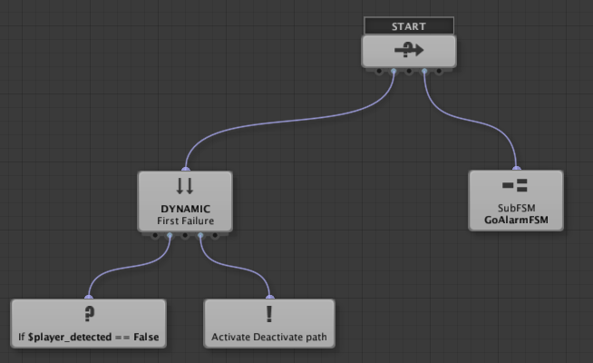

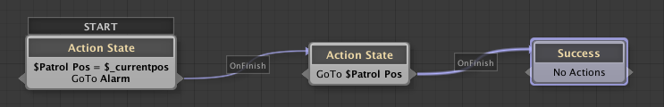

.footnote[.blue[Need of Success and/or Failure States]]

---
class: left, middle, inverse

# Outline

* .brown[Introduction]

* .brown[Finite State Machines]

* .brown[Decision Trees]

* .cyan[Behaviour Trees]

  - .brown[Design]

  - .brown[NodeCanvas]

  - .cyan[Behaviour Bricks]

* Planning Systems

* Rule-Based Systems

* References

---

# [Behaviour Bricks](http://bb.padaonegames.com/doku.php)

.blue[ToSteal] behaviour tree:

.cols5050[
.col1[
.blue[Starting]:
- [Handout](resources/dm1-handout.unitypackage)
- Editor: <br> `Window - Behavior Bricks - Editor`
- Robber: <br> `Add Component - Behavior executor component`

.blue[BlackBoard / properties]:
- `MoveToRandomPosition`: Floor
- `MoveToGameObject`: Treasure

.blue[Conditions]:
- [Custom conditions](codes/IsCopNear.html) / [download](codes/IsCopNear.cs)
]
.col2[
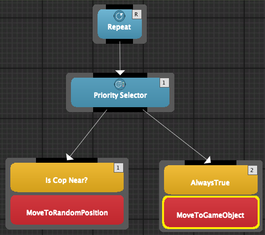
]]

---

# Behaviour Bricks II

.blue[ToSteal] behaviour tree:

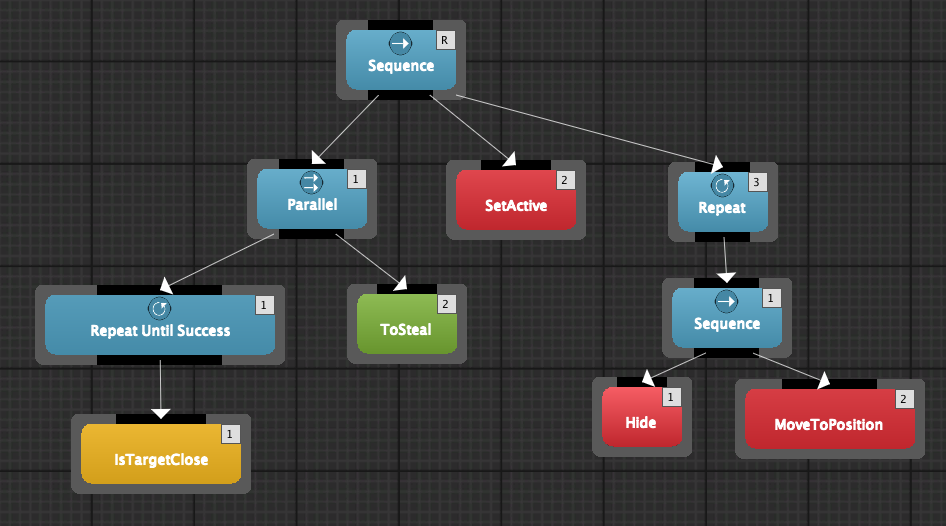

---

# Behaviour Bricks III

.blue[ToSteal] behaviour tree:

.blue[BlackBoard / properties]:
- `IsTargetClose`: Treasure, 2
- `ToSteal`: Floor, Treasure
- `SetActive`: false, Tresure
- `MoveToPosition`: hide

.blue[Actions]:
- [Custom actions](codes/HideBB.html) / [download](codes/HideBB.cs)

---
class: left, middle, inverse

# Outline

* .brown[Introduction]

* .brown[Finite State Machines]

* .brown[Decision Trees]

* .brown[Behaviour Trees]

* .cyan[Planning Systems]

  - .cyan[Goal Oriented Behaviour]
    
  - Goal Oriented Action Planning

  - AI Planner

* Rule-Based Systems

* References

---

# AI Paradigms

### Reactive AI:

- How to achieve goals $\rightarrow$ AI

- Exs: FSM, DT, BT

### Deliberative AI:

- World behaviour $+$ goals $\rightarrow$ AI

- AI decides how to achieve its goals

- Ex: Planners

### Games using dynamic planning:

- FEAR, Fallout 3, Total War, Deus Ex: Human Revolution, Shadow of Mordor, Tomb Raider

---

# Goal Oriented Behaviour

### Goals 

- each agent can have many active, and they could change

- try to fulfill its goals or reduce its .blue[insistence] (importance or priority as a number)

- examples: eat, drink, kill enemy, regenerate health, etc.

### Actions

- atomic behaviours that fulfill a requirement

- combination of positive and negative effects <br>
Ex: “play game console” increases *happiness* but decreases *energy*

- environment can generate or activate new available actions (.blue[smart objects])

.footnote[.red[Source]: (Millington, 2019)]

---

# GOB: Simple Selection

### People simulation example:

```
Goal: Eat = 4 
Goal: Sleep = 3
Action: Get-Raw-Food (Eat − 3)
Action: Get-Snack (Eat − 2)
Action: Sleep-In-Bed (Sleep − 4)
Action: Sleep-On-Sofa (Sleep − 2)
```
- .blue[heuristic] needed: most pressing goal, random...

- .blue[$+$] fast, simple

- .blue[$-$] side effects, no timing information

.footnote[.red[Source]: (Millington, 2019)]

--

```
Goal: Eat = 4 
Goal: Bathroom = 3
Action: Drink-Soda (Eat − 2; Bathroom + 3)
Action: Visit-Bathroom (Bathroom − 4)
```
---

# GOB: Discontent

It is an *energy metric* to minimize:

- Sum of insistence values of all goals

- Sum of square values: it accentuates high values

### Example:

```
Goal: Eat = 4 
Goal: Bathroom = 3
Action: Drink-Soda (Eat − 2; Bathroom + 2)
    after: Eat = 2, Bathroom = 5: Discontentment = 29
Action: Visit-Bathroom (Bathroom − 4)
    after: Eat = 4, Bathroom = 0: Discontentment = 16
```

```
Solution: Visit-Bathroom
```

.footnote[.red[Source]: (Millington, 2019)]

---

# GOB: Timing

### Example with time

```
Goal: Eat = 4 changing at + 4 per hour
Goal: Bathroom = 3 changing at + 2 per hour
Action: Eat-Snack (Eat − 2) 15 minutes
    after: Eat = 2, Bathroom = 3.5: Discontentment = 16.25
Action: Eat-Main-Meal (Eat − 4) 1 hour
    after: Eat = 0, Bathroom = 5: Discontentment = 25
Action: Visit-Bathroom (Bathroom − 4) 15 minutes
    after: Eat = 5, Bathroom = 0: Discontentment = 25
```

```
Solution: Eat-Snack
```

.footnote[.red[Source]: (Millington, 2019)]

---

# GOB Design

```
Goal: Eat = 4 changing at + 4 per hour
Goal: Bathroom = 3 changing at + 2 per hour
Action: Eat-Snack (Eat − 2) 15 minutes
Action: Eat-Main-Meal (Eat − 4) 1 hour
Action: Visit-Bathroom (Bathroom − 4) 15 minutes
```

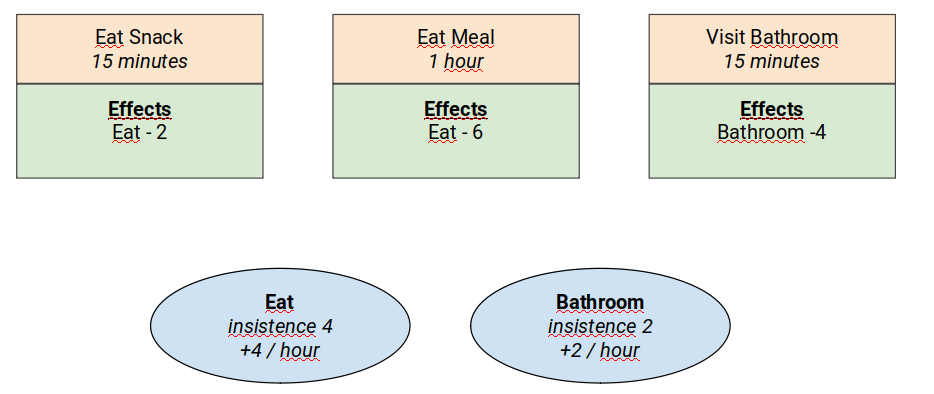

---
class: left, middle, inverse

# Outline

* .brown[Introduction]

* .brown[Finite State Machines]

* .brown[Decision Trees]

* .brown[Behaviour Trees]

* .cyan[Planning Systems]

  - .brown[Goal Oriented Behaviour]
    
  - .cyan[Goal Oriented Action Planning]

  - AI Planner

* Rule-Based Systems

* References

---

# The need for planning

The goal that an action promises to fulfill might be several steps away.

It is possible that we pick a stupid decision because the agent cannot plan ahead.

```
Goal: Heal = 4
Goal: Kill-Ogre = 3
Action: Fireball (Kill-Ogre − 2) 3 energy-slots
Action: Lesser-Healing (Heal − 2) 2 energy-slots
Action: Greater-Healing (Heal − 4) 3 energy-slots
```
---

# GOAP x2

---

# GOAP Design

---
class: left, middle, inverse

# Outline

* .brown[Introduction]

* .brown[Finite State Machines]

* .brown[Decision Trees]

* .brown[Behaviour Trees]

* .cyan[Planning Systems]

  - .brown[Goal Oriented Behaviour]
    
  - .brown[Goal Oriented Action Planning]

  - .cyan[AI Planner]

* Rule-Based Systems

* References

---

0. Explicació amb video

1. Disseny GOAP Robber lineal

2. Implementació

3. Modificació per bucle wander + approach

---
class: left, middle, inverse

# Outline

* .brown[Introduction]

* .brown[Finite State Machines]

* .brown[Decision Trees]

* .brown[Behaviour Trees]

* .brown[Planning Systems]

* .cyan[Rule-Based Systems]

* References

---

1. Teoria llibre

2. Implementació exemple amb clojure sense unity

3. implementar en Haskell fets + regles

4. Implementació Clojure + arcadia <br>
Pel final de curs (després de ML)

---
class: left, middle, inverse

# Outline

* .brown[Introduction]

* .brown[Finite State Machines]

* .brown[Decision Trees]

* .brown[Behaviour Trees]

* .brown[Planning Systems]

* .brown[Rule-Based Systems]

* .cyan[References]

---

# References

- Ian Millington. _AI for Games_ (3rd edition). CRC Press, 2019.

- Penny de Byl. [_Artificial Intelligence for Beginners_](https://learn.unity.com/course/artificial-intelligence-for-beginners). Unity Course.

- Chris Simpson. [_Behavior trees for AI: How they work_](https://www.gamasutra.com/blogs/ChrisSimpson/20140717/221339/Behavior_trees_for_AI_How_they_work.php). Gamasutra, 2014.

- Damian Isla. [_Handling Complexity in the Halo 2 AI_](https://www.gamasutra.com/view/feature/130663/gdc_2005_proceeding_handling_.php). GDC, 2005.

- Ricard Pillosu. _Previous year slides of the AI course_, 2019. 

---

# Pendent

- [Unite 2014 - Practical AI in Unity](https://www.youtube.com/watch?v=hhByGZZbcOc), 59:44, 2014. (HFSM, BT) [Github](https://github.com/AngryAnt/PracticalAIinUnity)

- AI Rules i/o arcadia/clojure (teoria lisp i intèrpret i lab amb asset)

- Rule-Based Systems al final de tot. Clojure. Si dóna temps.
